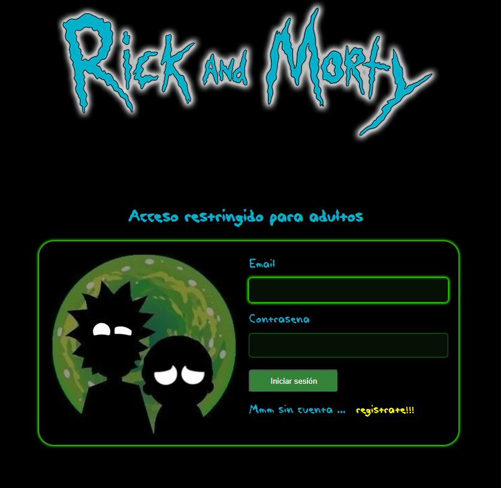

# Proyecto final de Front end 3

## Desarrollador

- Daniel Cortés (dancoweb@gmail.com)

## Tecnología

- [node.js v22.9.0](https://nodejs.org/en/download/prebuilt-installer/current)
- [react.js v18.3.1](https://react.dev/learn/installation)

## Compilación y ejecución de la aplicación local

Vaya a la carpeta del proyecto y escriba el siguiente comando para instalar todos los paquetes npm

```bash
npm install
```

Para ejecutar la aplicación, escriba el siguiente comando

```bash
npm run dev
```

## Test

Instalar dependencia

```bash
npm install vitest happy-dom -D
```

## Diseño de la aplicación

Es un proyecto que está echo en React.js que contiene los siguientes temas:

1. Hooks
   - useState
   - useEffect
   - createContext
   - useCallback
2. Componentes
3. Uso de props
4. Estructura de carpetas
5. Router
   - Rutas normales
   - Rutas dinámicas
6. Formularios
7. Testing básico

## Aplicativo

1. Multi-usuario
   - Al registrarse se genera un arreglo de usuarios y se guardan en el sessionStorage
2. Notificaciones
   - Las notificaciones se generaron con el componente de [sonner](https://sonner.emilkowal.ski/)
3. Validaciones de:
   - Usuario no registrado
   - Usuario ya registrado
4. Favoritos
   - Se agregan y se eliminan con un botón
   - Se valida duplicidad de personajes (para no agregar 2 veces el personaje)
